# ODB 'Rewards Program' Calculator
Software to ease the process of tracking payouts and tier requirements for sales contractors within the org.
<br></br>
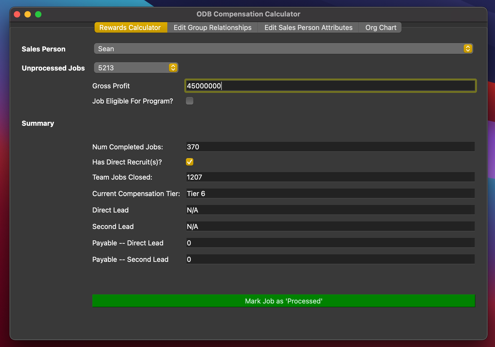
<br></br>

## Normal Workflow
On the main __'Rewards Calculator'__ tab, unprocessed jobs will appear in the __'unprocessed jobs'__ dropdown.

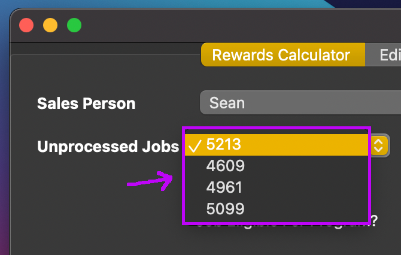

Select the job number for whichever job you'd like to process.  The associated sales person will populate in the dropdown above along with their summary stats in the below __'Summary'__ table.

<br></br>

Input the appropriate __'Gross Profit'__ number for the job and also select whether this job meets requirements for the rewards program (>= 20% Gross Profit) by checking the __'Job Eligible For Program?'__ checkbox.

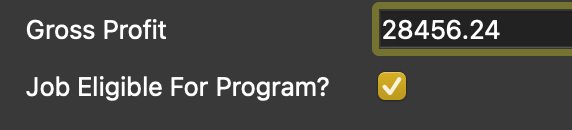
<br></br>
<br></br>

If the sales person has an associated direct / secondary lead(s) then the __'payout'__ amounts will be shown in the respective __'Payout -- Direct Lead'__ and __'Payout -- Second Lead'__ boxes.

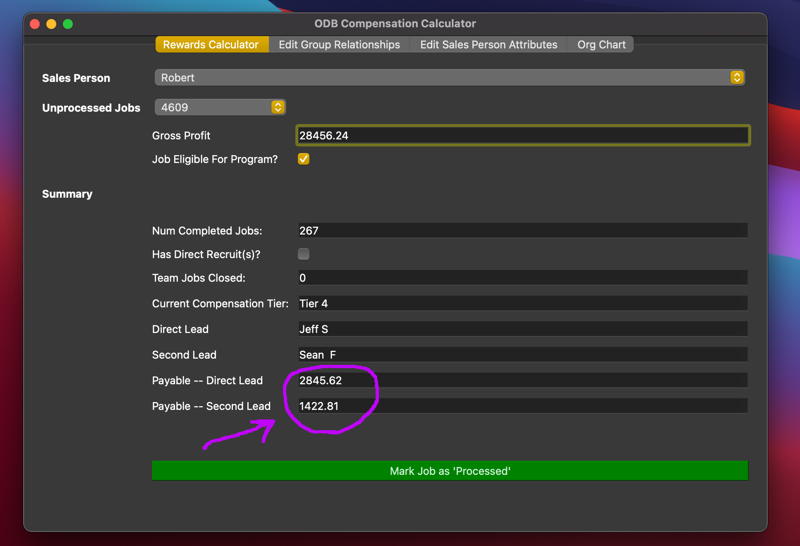
<br></br>
<br></br>


Then in order to save the updated information to the __'closed_jobs'__ database table, click on the __'Mark Job as "Processed"'__ button.

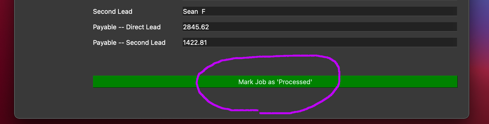
<br></br>
<br></br>

## Peripheral Functions

### Adding New Sales People
Everytime the application is opened, it will make a connection with Acculynx to see if any new sales people have been added.  If there have been additional sales people added on Acculynx, the application will update the associated database table and the app's __'sales person'__ dropdown lists.  You don't have to take any action here.

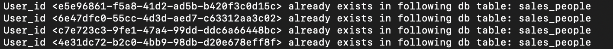
<br></br>
<br></br>

### Setting / Updating Sales Person Attributes
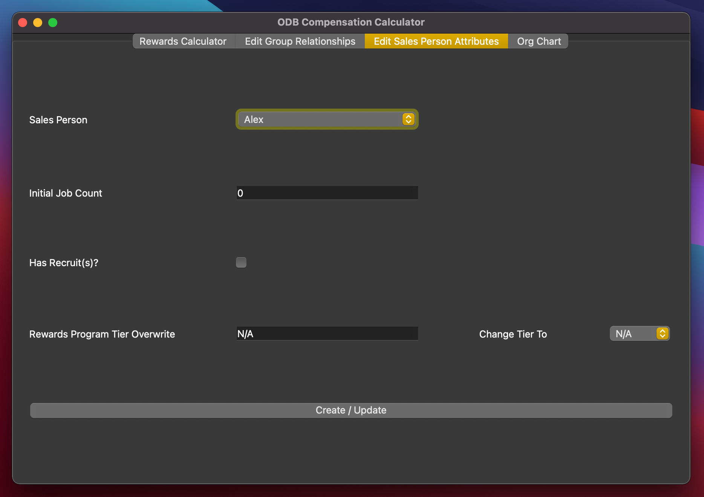

__'Initial Job Count'__ -- The job count for each contractor prior to this tracking / program starting.

__'Has Recruit(s)?'__ -- Does the contractor have a direct recruit?

__'Rewards Program Tier Overwrite'__ -- Do you want the contractor adjusted to a higher rewards program tier than the one they would naturally be categorized into?  If you do want to set this, in the dropdown next to the __'Change Tier To'__ text select the appropraite rewards tier to start that contractor at.  For more information on how this overwrite is used, see __'Rewards Tier Overwrite'__ under __'Internals'__ section.

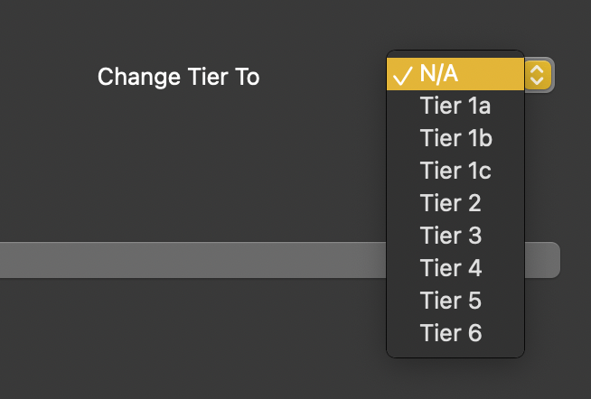
<br></br>
<br></br>

If attributes, already exist for a sales person, the text boxes will populate with the current values that are tracked for the given sales person.

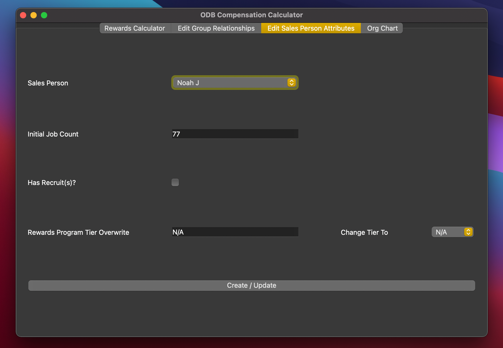
<br></br>
<br></br>

Once the contractor attributes are set to your liking, click the __'Create / Update'__ button.

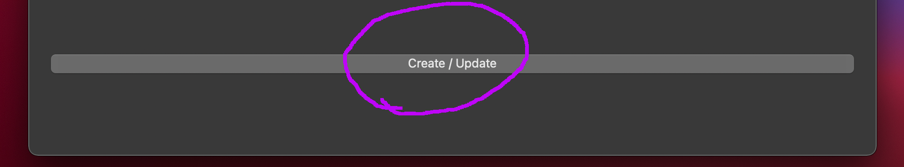
<br></br>
<br></br>

### Setting / Updating Teams
Go to the __'Edit Group Relationships'__ tab.  From the __'Sales Person'__ dropdown, select the contractor of interest.  If they have existing team data saved in the database, this info will populate for the __'Current Direct Lead'__ and __'Current Second Lead'__ boxes.

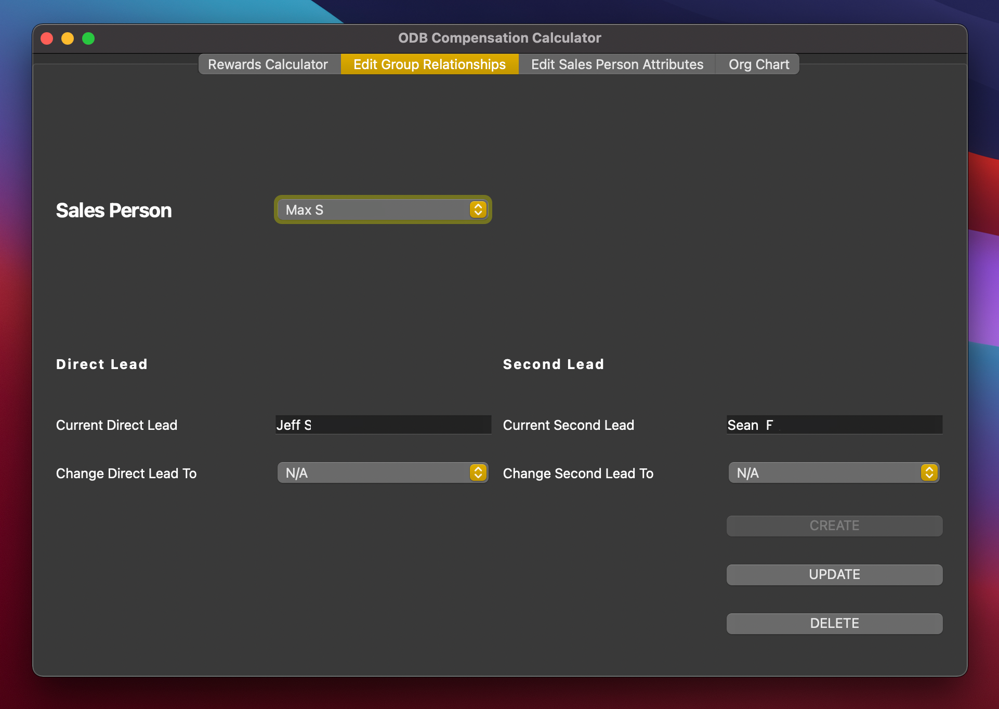
<br></br>
<br></br>

If you want to change the team relationships for this selected sales person, select the appropriate names in the dropdown next to __'Change Direct Lead To'__ and/or __'Change Second Lead To'__ and then click the __'Update'__ button.

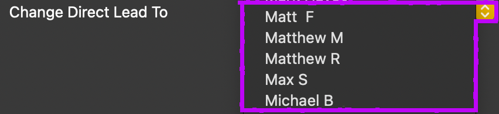
<br></br>
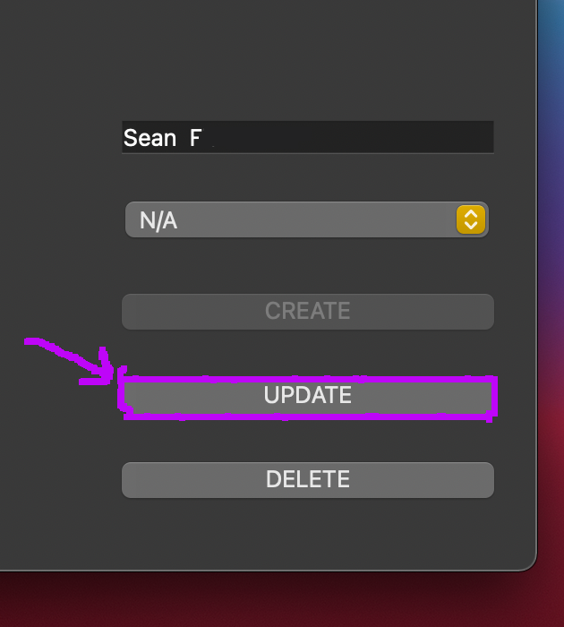
<br></br>
<br></br>


If a team / group relationship does not exist for the sales contractor yet, __'Current Direct Lead'__ and __'Current Second Lead'__ will be set to the default __'N/A'__ value.  Also, the app will only allow you to click the __'Create'__ button (__'Update'__ and '__Delete__' buttons will be disabled).

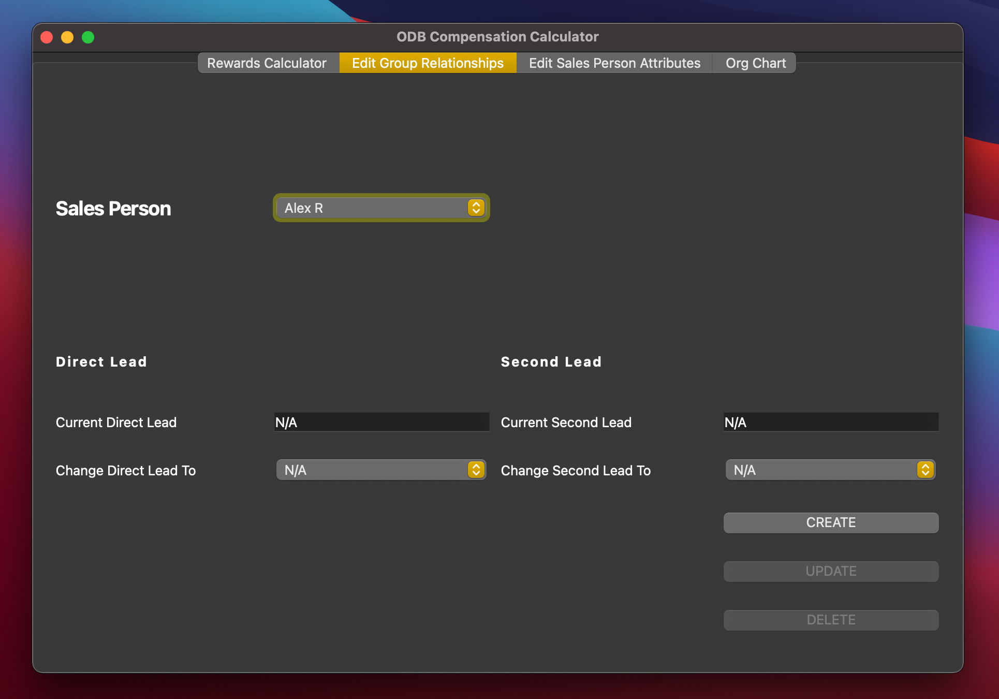
<br></br>
<br></br>

### Viewing Organization Chart
In order to view the org chart, navigate to the 'Org Chart' tab in the app.  This chart displays the org umbrella from the perspective of the sales person (up to two levels below them) and the associated individual / team jobs and tiers of those that fall under the umbrella.

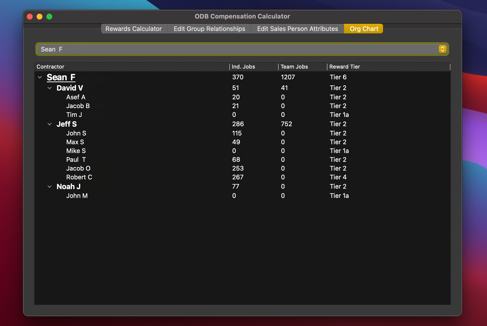
<br></br>
<br></br>

## Using pgAdmin4 To View Database Tables
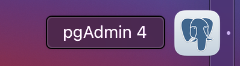

Open up the pgAdmin4 app and click on the 'aws-odb-compensation' database.
<br></br>
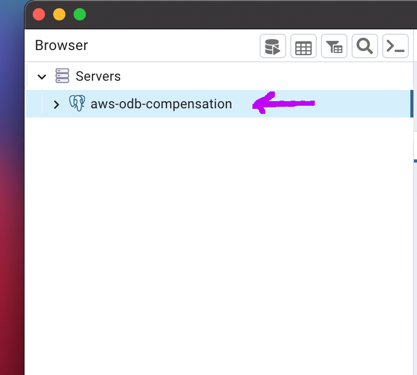
<br></br>
<br></br>

Click on the 'Tables' folder.  And then go to the __'Query Tool'__.
<br></br>
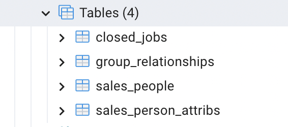
<br></br>
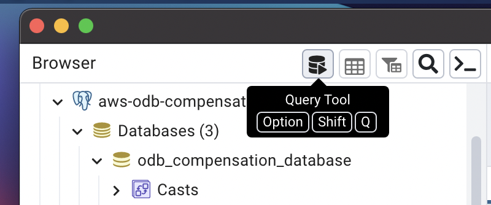
<br></br>
<br></br>

Use the resulting query box to run and return queries to database tables.
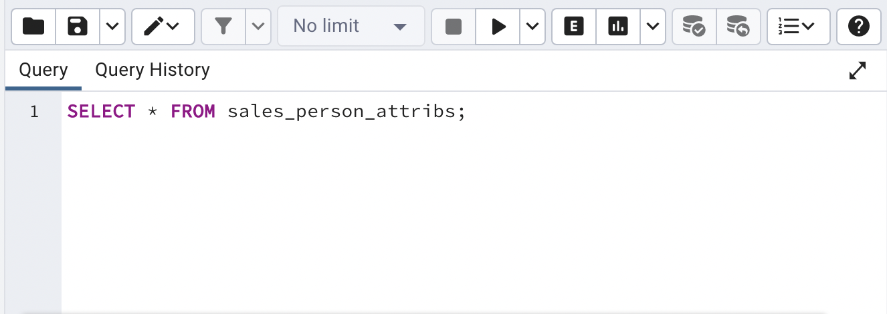

### Helpful SQL Queries
- [X] ```SELECT * FROM {table_name_here}``` --> View a full table
- [ ] TODO:  Show query to return rewards program compensation totals by sales person


## Internals

### Database Info
4 Database Tables (Hosted on Amazon Web Services -- PostgreSQL Engine)
<br></br>


__'sales_people'__:  Job info is tracked by a sales person ID on the Acculynx API.  This table maps the __'sales_person_id'__ to their __'full_name'__ per Acculynx.  It allows us to see who the sales person was for the job when the API only provides the sales_person_id_hash, e.g. "3g413539-1711-4745-9403-9fc2600b6a44".

__'sales_person_attribs'__: Tracks attributes for each contractor such as their initial job count, whether they have a direct recruit, and whether or not they have a rewards tier overwrite associated with them.

__'closed_jobs'__:  Tracks all Acculynx jobs that have the 'closed' milestone (after 3/23/2023).  It will append additional compensation information as jobs are processed, such as who the associated Direct Lead and Second Lead were and whether they had payouts for these jobs.

__'group_relationships'__:  Three column table showing the sales person relationship to their Direct Lead and Second Lead.

### Rewards Tier Overwrites
Internally, the app will gather all rewards program related datapoints, such as an individual job count, team job count, and whether or not the contractor has a direct recruit.  Their compensation tier is then calculated.  If the contractor has a rewards tier overwrite, the app will check to see if this overwrite tier is greater than their base caclulated tier.  The greater of the two is returned.  This allows you to both set a rewards tier that exceeds a contractor's current tier and also allows them to progress through the rewards program tiers later on as they meet/exceed the requirements for higher tiers.

## Testing

test_group_relationships.py

test_gui_job_processing.py

test_gui.py

test_job_object.py

test_sales_person_attribs.py

## TODO
- [ ] Set 'Has Recruit(s)? attributes for all contractors

## Considerations
- [ ] Order of jobs in that 'unprocessed' jobs list on main tab -- this will have implications for comp